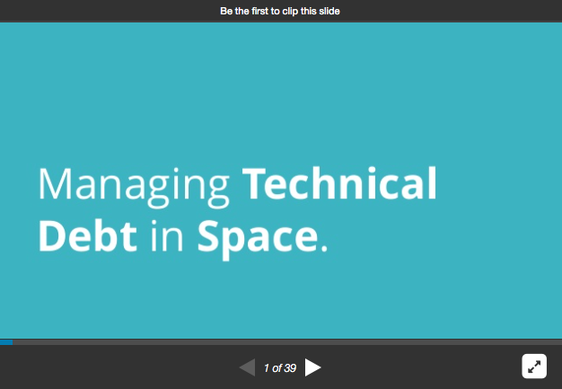

# What

My slides and notes for the [100 Year Starship Conference 2015](https://2015.symposium.100yss.org): Human Interstellar Travel in the next 100 years.

You can also see the [slides online](http://www.slideshare.net/jesterxl/technical-debt-in-space-jesse-warden-100yss-2015).

# Research Notes and Citations

http://www.fastcompany.com/28121/they-write-right-stuff

https://en.wikipedia.org/wiki/Capability_Maturity_Model

http://www.ibiblio.org/apollo/Gemini.html

http://history.nasa.gov/computers/Ch1-2.html

http://history.nasa.gov/computers/Ch4-5.html

http://www.angelfire.com/space2/sp425/25.html

http://history.nasa.gov/computers/Ch1-2.html

https://en.wikipedia.org/wiki/Dead_reckoning

https://en.wikipedia.org/wiki/Inertial_measurement_unit

http://www.ibiblio.org/apollo/Gemini.html

https://en.wikipedia.org/wiki/Apollo_program

https://en.wikipedia.org/wiki/Human_spaceflight

https://en.wikipedia.org/wiki/ASC-15

https://en.wikipedia.org/wiki/JOVIAL (B2 originally written in this, changed to C)

https://en.wikipedia.org/wiki/DMS_Software_Reengineering_Toolkit

Navigation Challenges
https://www.youtube.com/watch?v=G7CwbCEwT_c
http://www.thelivingmoon.com/41pegasus/02files/Speed_of_Earth.html
- Earth wobbles
- earth spin
- rotation
- earth orbits sun
- sun moving
- solar system moving upwards
- solar system rotating

Bacteria Mutations based on radioactive exposure @ 13:00
https://www.youtube.com/watch?v=iuJ2tp57qvs
Good example may be adjusting that algorithm.

Superconducting Magnets are used to channel heated argon plasma
https://en.wikipedia.org/wiki/Superconducting_magnet

3U CubeSat Relays for internet breadcrumbs

3D Awesome
http://stuffin.space/

Source Code
https://github.com/jeyoder/ThingsInSpace/blob/master/web-root/scripts/satellite.js

Python shows every satellite on horizon over 3 minutes
https://www.reddit.com/r/dataisbeautiful/comments/3gxp87/i_just_plotted_every_tleinfo_satellite_above_my/

Deep learning:
http://people.idsia.ch/~juergen/deep-learning-conspiracy.html

More deep learning:
http://www.forbes.com/sites/alexknapp/2015/09/09/this-startup-has-a-brain-inspired-chip-for-machine-learning/?utm_campaign=ForbesTech&utm_source=TWITTER&utm_medium=social&utm_channel=Technology&linkId=16929696

Communicate Long Distances
https://medium.com/starts-with-a-bang/ask-ethan-105-are-we-looking-for-et-all-wrong-38c33f95c44c

Brain Grow in Labs
http://www.forbes.com/sites/janetstemwedel/2015/09/18/is-it-ethically-unproblematic-to-grow-brains-in-labs/

AI in Games
http://www.gamasutra.com/view/news/253974/When_artificial_intelligence_in_video_games_becomesartificially_intelligent.php

Hydrodrones
http://techcrunch.com/2015/09/23/hydroswarms-drones-could-solve-our-ignorance-of-the-oceans/?ncid=rss&utm_source=feedburner&utm_medium=feed&utm_campaign=Feed%3A+Techcrunch+%28TechCrunch%29&sr_share=twitter

Simple Correlation Matrix
http://bl.ocks.org/emeeks/671c0e7adfb1ce7060b8

Nigel on DevOps in Space
https://www.accenture.com/us-en/blogs/blogs-lessons-from-rocket-science-part-1-2

If AI is shipped, and it’s the first, then you can use it to decrypt RSA for secret messages, etc. since it’s vulnerable to it.
http://blog.cryptographyengineering.com/2015/10/a-riddle-wrapped-in-curve.html

Examples of what time is it:
http://seriot.ch/resources/talks_papers/20151022_time_and_computers_softshake.pdf

Entanglement is real (again)
http://www.nytimes.com/2015/10/22/science/quantum-theory-experiment-said-to-prove-spooky-interactions.html?_r=1

Legally elapsed seconds
http://www.ucolick.org/~sla/leapsecs/epochtime.html

Time smearing
https://googleblog.blogspot.ch/2011/09/time-technology-and-leaping-seconds.html

3 body problem, also talks about using computers to solve problems, and using planet alignments to slingshot craft
http://www.edn.com/electronics-blogs/math-is/4415981/Voyager--The-mathematics-of-interstellar-space-travel

How good deep learning is at particular data points:
http://www.technologyreview.com/featuredstory/513696/deep-learning/

The Blue Brain project has a sub-set that is about reconstructing a rat brain in a computer. Also covers neuromorphic computing. One interesting concept is wiring these computers to a robot, then introducing distortions, then replaying the result, much like Clojure. In doing so, you can get a hint as to what makes Autism tick. IMPORTANT to make a correleary that while the human genome project lead to more questions, and less answers about solving disease, the brain project might have the same end.
http://bluebrain.epfl.ch/page-56882-en.html

Part of Cell explains the sub-set of the Blue Brain project which describes the details of the rat brain mapping:
http://www.cell.com/cell/abstract/S0092-8674(15)01191-5

Figure out what an ion channel is in context to neurons

The dark matter reason why TeVaS doesn’t work, but only for small galaxies.
https://medium.com/starts-with-a-bang/throwback-thursday-how-dark-matter-s-1-competitor-died-fdcb462d854d#.mykbzcrj9

Storing data in DNA instead of hard disks:
http://www.extremetech.com/extreme/134672-harvard-cracks-dna-storage-crams-700-terabytes-of-data-into-a-single-gram#.VickUDCd878.facebook

Spreading life beyond the solar system:
http://settlement.arc.nasa.gov/

SonarCube’s technical debt stats:
http://www.sonarqube.org/evaluate-your-technical-debt-with-sonar/

1. Marxism works on paper… but so does my code till I unit test it
2. improving life on earth: show that nasa mars landing with fox news lol
3. cars coded to kill: talk about the republicans, my mom, the ethical challenges, range of probabilities, and how quantum computing can work here to help increases probabilities.

Paralyzed person controls tablet and Googles
http://singularityhub.com/2015/10/25/scientists-connect-brain-to-a-basic-tablet-paralyzed-patient-googles-with-ease/

Alcohol + Sugar releasing commet
http://www.eurekalert.org/pub_releases/2015-10/nsfc-rcc102315.php

Speed of light Kernal predictions
http://nuit-blanche.blogspot.com/2015/10/approximating-kernels-at-speed-of-light.html

Future of Autonomous Spacecraft with a simple, low-power chip, similar to Arduino.
http://www.forbes.com/sites/alexknapp/2015/09/09/this-startup-has-a-brain-inspired-chip-for-machine-learning/?utm_campaign=ForbesTech&utm_source=TWITTER&utm_medium=social&utm_channel=Technology&linkId=16929696